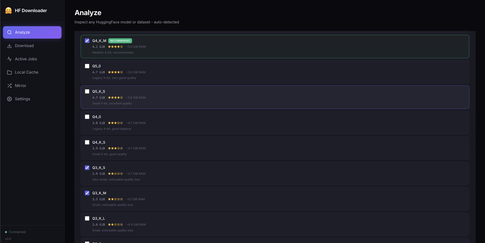
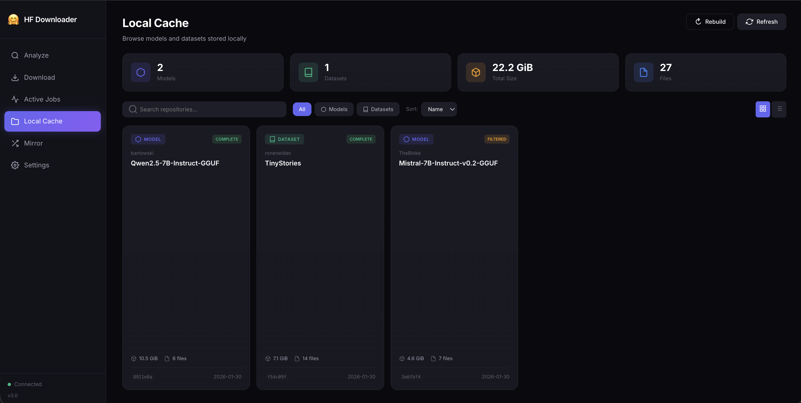
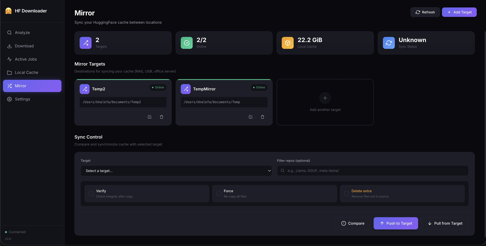

# HFDesk

Desktop-style web UI for finding, analyzing, and downloading Hugging Face models.

HFDesk starts as a small local web server and opens a focused interface for model search, GGUF quantization analysis, resumable downloads, cache browsing, and job history.

## Screenshots

### Models



### Active Jobs



### History and Settings



## Features

- Search models and datasets on the Hugging Face Hub.
- Analyze repositories before downloading, including GGUF quantizations and RAM estimates.
- Correctly handles sharded GGUF files as one quantization option.
- Parallel downloads with resume support and active job tracking.
- Optional per-download folders via `--local-dir`.
- Local cache browser for HF cache, friendly view folders, and LM-style local model folders.
- Download history, disk-free indicator, settings page, and proxy support.
- Compatible with the standard Hugging Face cache layout.

## Install

Install from source:

```bash
go install github.com/bashrusakh/hfdesk/cmd/hfdesk@latest
```

Or download a binary from the [Releases](https://github.com/bashrusakh/hfdesk/releases) page.

## Run

```bash
hfdesk
```

Then open:

```text
http://localhost:8080
```

Useful options:

```bash
hfdesk --open
hfdesk --port 9090
hfdesk --cache-dir /path/to/huggingface/cache
hfdesk --local-dir /path/to/models
hfdesk --token hf_xxx
```

## Config

HFDesk reads `hfdownloader.json`, `hfdownloader.yaml`, or `hfdownloader.yml` from the folder where it is launched. If none exists, settings saved from the UI are written to `hfdownloader.json` in that folder.

Example:

```json
{
  "cache-dir": "I:/huggingface",
  "connections": 8,
  "max-active": 3,
  "verify": "size",
  "retries": 4
}
```

## Development

```bash
go build -o hfdesk ./cmd/hfdesk
./hfdesk --open
```

## Credits

HFDesk is a fork of [bodaay/HuggingFaceModelDownloader](https://github.com/bodaay/HuggingFaceModelDownloader).

Original project copyright and license notices are retained. Licensed under the Apache License 2.0; see [LICENSE](LICENSE).
