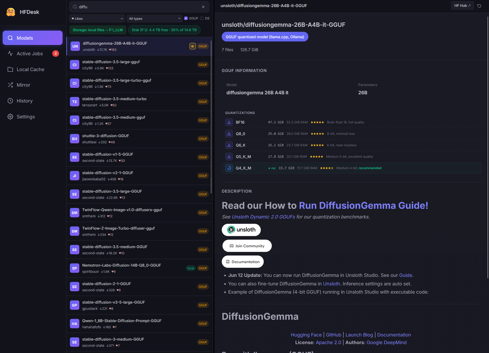
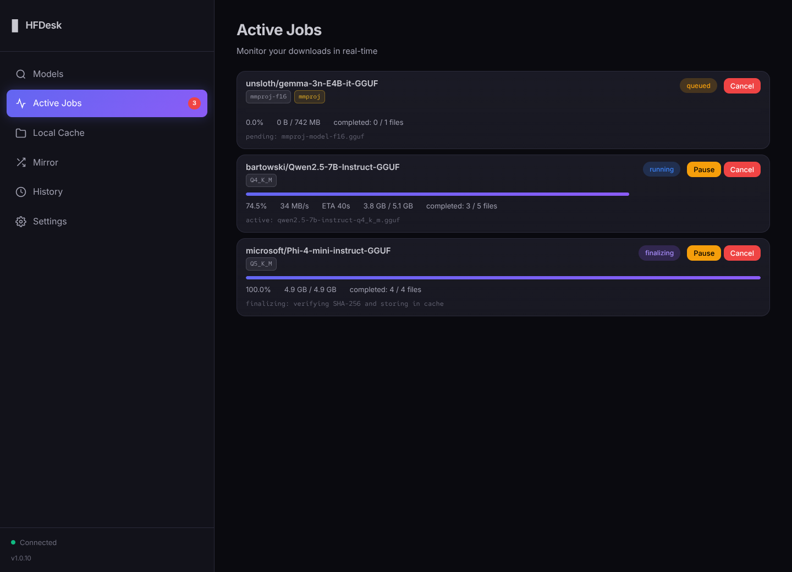
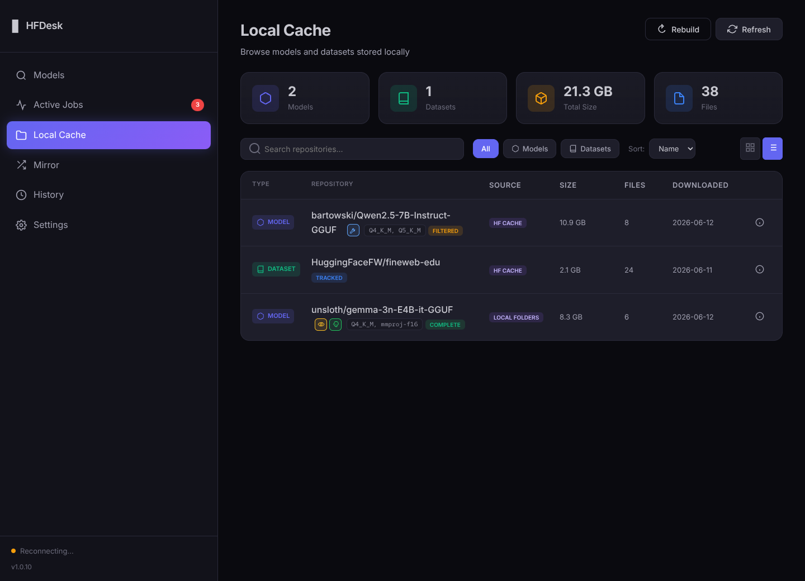
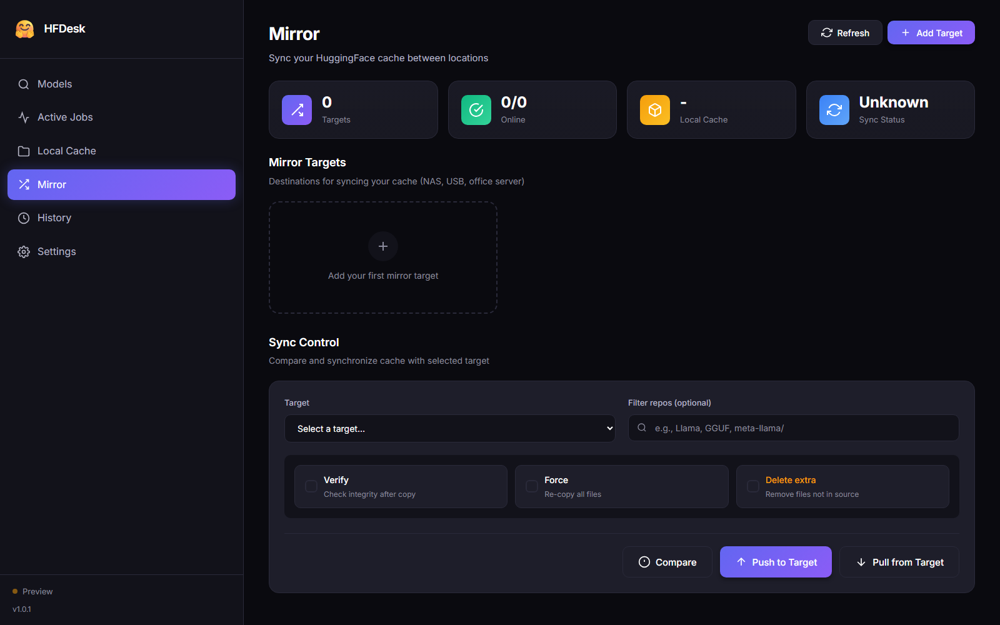
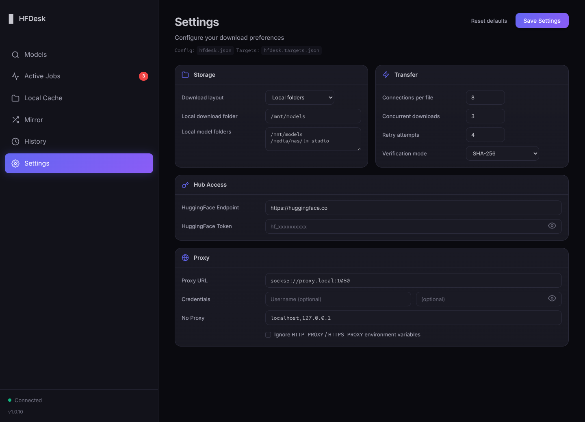

# HFDesk

<p align="center">
  <strong>A focused local dashboard for finding, analyzing, and downloading Hugging Face models.</strong>
</p>

<p align="center">
  <a href="https://github.com/bashrusakh/hfdesk/releases"></a>
  <a href="https://pkg.go.dev/github.com/bashrusakh/hfdesk"></a>
  <a href="LICENSE"></a>
</p>

<p align="center">
  
</p>

HFDesk runs as a small local web server and gives you a desktop-style browser UI for the full model workflow: search the Hub, inspect GGUF quantizations, pick files, download with resume support, browse local cache, and mirror model storage to another drive.

## Screenshots

| Models | Active Jobs |
|---|---|
|  |  |

| Local Cache | Mirror |
|---|---|
|  |  |

| Settings |
|---|
|  |

## Highlights

- Search models and datasets directly from the Hugging Face Hub.
- Analyze repositories before downloading, including GGUF quantizations, file groups, RAM estimates, and recommended picks.
- Correctly groups sharded GGUF files into one quantization option.
- Parallel resumable downloads with retries, progress events, and active job tracking.
- Standard Hugging Face cache layout or LM Studio-style local files under `<folder>/<owner>/<model>`.
- Local cache browser for HF cache, friendly folders, and user-added LM Studio-style model directories.
- Mirror cache contents to a NAS, USB drive, or another machine.
- Download history, disk-free indicator, proxy support, and optional basic auth.
- Single static binary with embedded web assets.

## Install

Download a prebuilt binary from [Releases](https://github.com/bashrusakh/hfdesk/releases), or install from source:

```bash
go install github.com/bashrusakh/hfdesk/cmd/hfdesk@latest
```

Docker:

```bash
docker run --rm -p 8080:8080 \
  -v ~/.cache/huggingface:/root/.cache/huggingface \
  ghcr.io/bashrusakh/hfdesk:latest
```

## Quick Start

```bash
hfdesk
```

HFDesk opens [http://localhost:8080](http://localhost:8080) automatically.

Useful options:

```bash
hfdesk --no-open
hfdesk --port 9090
hfdesk --token hf_xxx
hfdesk --cache-dir /mnt/ssd/huggingface
hfdesk --local-dir /mnt/models
```

## Configuration

HFDesk reads `hfdesk.json`, `hfdesk.yaml`, or `hfdesk.yml` from the launch directory first, then from `~/.config`. Settings saved from the UI are written back to the launch directory.

```json
{
  "token": "hf_xxx",
  "cache-dir": "/mnt/ssd/huggingface",
  "connections": 8,
  "max-active": 3,
  "multipart-threshold": "32MiB",
  "verify": "size",
  "retries": 4,
  "endpoint": "https://huggingface.co"
}
```

Proxy example:

```json
{
  "proxy": {
    "url": "socks5://proxy.internal:1080",
    "username": "user",
    "password": "pass",
    "no_proxy": "localhost,127.0.0.1"
  }
}
```

## API

HFDesk's web UI is backed by a local JSON API. See [docs/API.md](docs/API.md) for endpoints, request shapes, and response formats.

## Build

```bash
git clone https://github.com/bashrusakh/hfdesk
cd hfdesk
go build -o hfdesk ./cmd/hfdesk
./hfdesk
```

Run tests:

```bash
go test ./...
go test ./... -race
```

## Credits

HFDesk is a fork of [bodaay/HuggingFaceModelDownloader](https://github.com/bodaay/HuggingFaceModelDownloader). Original copyright and license notices are retained. Licensed under the [Apache License 2.0](LICENSE).
