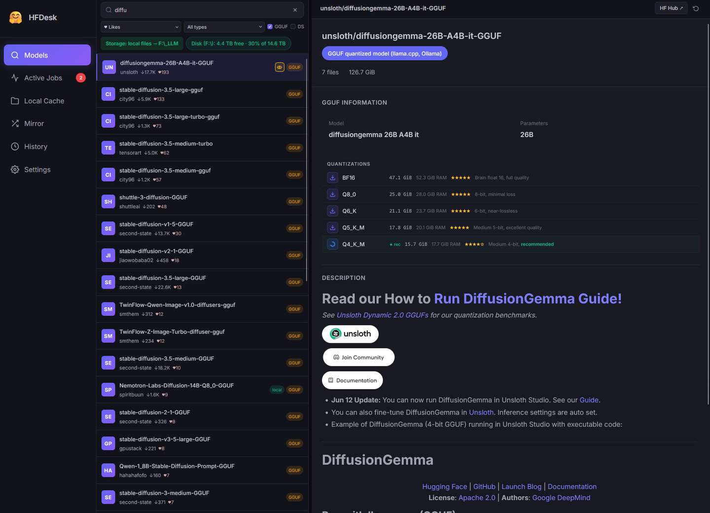
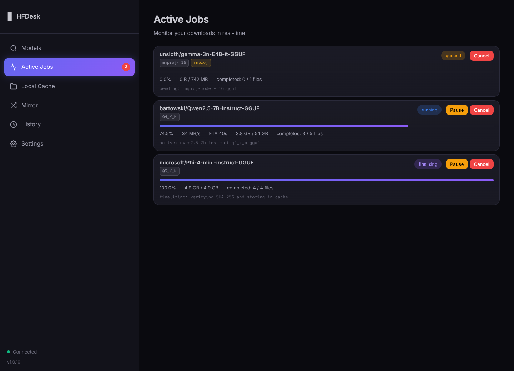
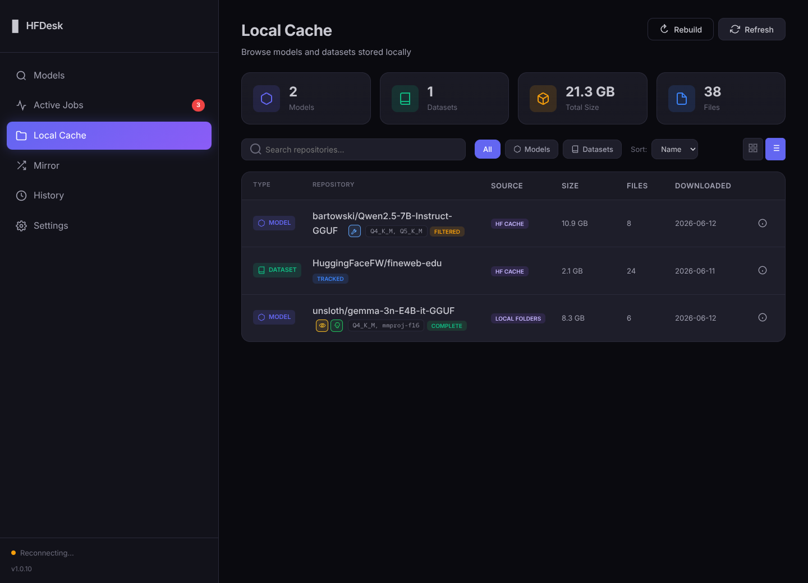
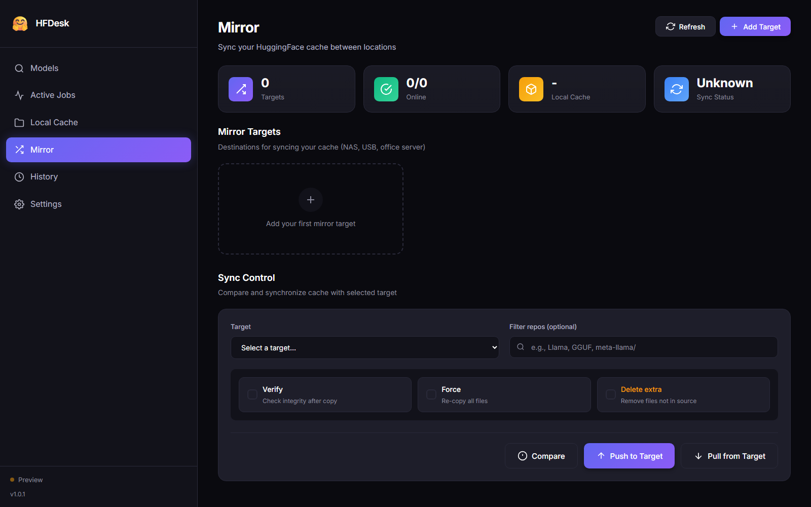
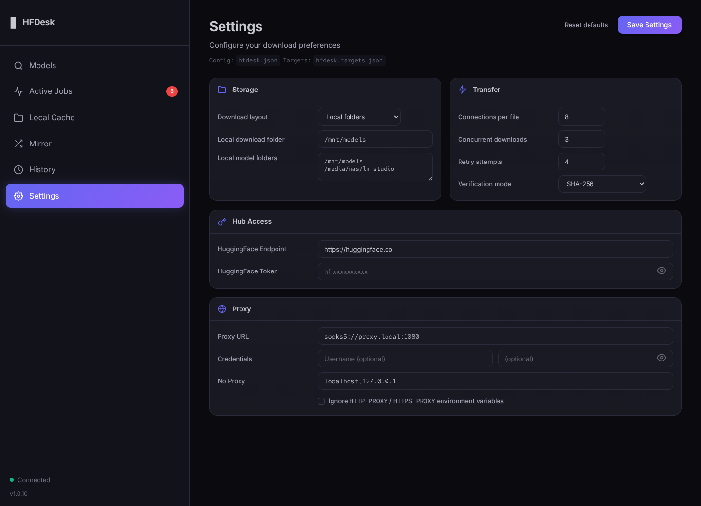

# HFDesk

<p align="center">
  <strong>A focused local dashboard for finding, analyzing, and downloading Hugging Face models.</strong>
</p>

<p align="center">
  <a href="https://github.com/bashrusakh/hfdesk/releases"></a>
  <a href="https://pkg.go.dev/github.com/bashrusakh/hfdesk"></a>
  <a href="LICENSE"></a>
</p>

<p align="center">
  
</p>

HFDesk runs as a small local web server and gives you a desktop-style browser UI for the full model workflow: search the Hub, inspect GGUF quantizations, pick files, download with resume support, browse local cache, and mirror model storage to another drive.

## Screenshots

| Models | Active Jobs |
|---|---|
|  |  |

| Local Cache | Mirror |
|---|---|
|  |  |

| Settings |
|---|
|  |

## Highlights

- Search models and datasets directly from the Hugging Face Hub.
- Analyze repositories before downloading, including GGUF quantizations, file groups, RAM estimates, and recommended picks.
- Correctly groups sharded GGUF files into one quantization option.
- Parallel resumable downloads with retries, progress events, and active job tracking.
- Standard Hugging Face cache layout or LM Studio-style local files under `<folder>/<owner>/<model>`.
- Optionally route downloads into per-type folders (LLM/GGUF, LLM/Safetensors, Audio, Diffusion, Embedding).
- Local cache browser for HF cache, friendly folders, and user-added LM Studio-style model directories.
- Mirror cache contents to a NAS, USB drive, or another machine.
- Download history, disk-free indicator, proxy support, and optional basic auth.
- Single static binary with embedded web assets.

## Install

Download a prebuilt binary from [Releases](https://github.com/bashrusakh/hfdesk/releases), or install from source:

```bash
go install github.com/bashrusakh/hfdesk/cmd/hfdesk@latest
```

Docker:

```bash
docker run --rm -p 8080:8080 \
  -v hfdesk-data:/data \
  ghcr.io/bashrusakh/hfdesk:latest
```

By default, HFDesk consolidates writable application state (settings, jobs,
history, HF cache, and local models) under a single `/data` root. Mount one
volume at `/data` to persist it. Storage roots can be overridden (for example
`HF_HUB_CACHE`); see [Docker](#docker) for UID/GID options.

## Quick Start

```bash
hfdesk
```

HFDesk opens [http://localhost:8080](http://localhost:8080) automatically.

Useful options:

```bash
hfdesk --no-open
hfdesk --port 9090
hfdesk --token hf_xxx
hfdesk --cache-dir /mnt/ssd/huggingface
hfdesk --local-dir /mnt/models
```

## Configuration

HFDesk reads `hfdesk.json`, `hfdesk.yaml`, or `hfdesk.yml` from the launch directory first, then from `~/.config`. Settings saved from the UI are written back to the launch directory.

Ordinary settings updates preserve both the active Hugging Face token and any separately stored token. A runtime override such as `--token` is not copied to disk implicitly. In `POST /api/settings`, an explicitly authored nonempty `token` sets the active and stored credential; `"token": ""` clears both. Omitting `token`, sending `null`, or returning a redacted display value preserves it. Values beginning with `********` are reserved redaction markers, not credentials. Startup overrides still take precedence after a restart.

Saved configuration contains explicitly stored credentials in plaintext. New and existing files saved by HFDesk have owner-only permissions (`0600`) on Unix. A persistence warning means settings took effect in memory but were not saved; repair the file/path permissions or invalid configuration and save again before restarting.

```json
{
  "token": "hf_xxx",
  "cache-dir": "/mnt/ssd/huggingface",
  "connections": 8,
  "max-active": 3,
  "multipart-threshold": "32MiB",
  "verify": "size",
  "retries": 4,
  "endpoint": "https://huggingface.co"
}
```

The Hugging Face token is resolved as the `--token` flag, then the `HF_TOKEN` environment variable, then the `token` field in the config file. Set it at startup with:

```bash
HF_TOKEN=hf_xxx hfdesk
```

### Hub storage and friendly folders

`--cache-dir` / saved `cache-dir` selects the app root for friendly `models/`
and `datasets/` folders. Without that preference, `HF_HOME` or the existing
`~/.cache/huggingface` default supplies the root. Hub repositories normally live
in its `hub/` child, but nonempty `HF_HUB_CACHE` always selects the **exact Hub
directory**, even with an explicit app root:

```bash
HF_HUB_CACHE=/mnt/shared-hf-store hfdesk --cache-dir /mnt/friendly-views
```

Those roots need not be adjacent. Changing the app root does not move Hub files
or unset ENV. Server storage ENV/defaults are captured at startup; current cache,
mirror, rebuild, delete, and disk checks use that association. Existing jobs
freeze both destinations through pause/retry/requeue and restart. Legacy jobs
without a recorded Hub path use a warned, one-time startup fallback: their old
physical Hub cannot be recovered from the state file. No files are moved.

The Settings API separately exposes raw preference, effective Hub path, and its
source; see [API storage fields](docs/API.md#settings). Library `NewHFCache`
captures ENV per construction, while `Settings.HubDir` / `NewHFCacheResolved`
allow callers to reuse an already resolved association without reinterpreting
Hub ENV. Generated rebuild scripts preserve that association; ordinary app-root
scripts remain portable with the complete root, while external-H scripts retain
the selected absolute Hub location.

Proxy example:

```json
{
  "proxy": {
    "url": "socks5://proxy.internal:1080",
    "username": "user",
    "password": "pass",
    "no_proxy": "localhost,127.0.0.1"
  }
}
```

## API

HFDesk's web UI is backed by a local JSON API. See [docs/API.md](docs/API.md) for endpoints, request shapes, and response formats.

## Build

```bash
git clone https://github.com/bashrusakh/hfdesk
cd hfdesk
go build -o hfdesk ./cmd/hfdesk
./hfdesk
```

Run tests:

```bash
go test ./...
go test ./... -race
```

## Docker

By default, the image keeps writable application paths under one mounted data
root, `/data`. It sets `HOME=/data`, `XDG_CONFIG_HOME=/data/.config`, and
`HF_HOME=/data/.cache/huggingface`, and runs with `WORKDIR /data`:

| Path | Contents |
|---|---|
| `/data/.config/HFDesk` | Settings, jobs, and history state (`$XDG_CONFIG_HOME/HFDesk`) |
| `/data/.cache/huggingface` | Hugging Face cache (`HF_HOME`) |
| `/data/Models`, `/data/Datasets` | LM Studio-style local downloads |

The entrypoint does not pre-create these subdirectories: root startup hands only
the `/data` root itself to the app UID, while non-root startup changes no ownership.
The image's `/data` is world-writable (sticky mode `1777`); a bind mount supplies
its own permissions instead. The app creates its own state directories as the
target UID. Jobs/history state always resolves through
the per-user config directory above. A config file placed directly in the launch
directory (`/data/hfdesk.json`) is still read first and saved there, but a fresh
volume writes its config under `/data/.config/HFDesk`.

Run it with a single volume:

```bash
docker run --rm -p 8080:8080 \
  -v hfdesk-data:/data \
  ghcr.io/bashrusakh/hfdesk:latest
```

### Run as a specific UID/GID (NAS/homelab)

The default runtime UID/GID is `1000`. To run as another user and keep
files owned by that user, set `PUID`/`PGID`:

```bash
docker run --rm -p 8080:8080 \
  -e PUID=1026 -e PGID=100 -e UMASK=002 \
  -v /mnt/user/appdata/hfdesk:/data \
  ghcr.io/bashrusakh/hfdesk:latest
```

- `PUID` / `PGID` — UID/GID the app process runs as (default `1000`).
- `UMASK` — file creation mask (default `022`).

The container starts as root to prepare only the fixed `/data` root (a
nonrecursive, symlink-safe ownership change), then drops privileges numerically.
`/etc/passwd` and `/etc/group` remain byte-identical to the image even when the
requested IDs collide with existing accounts. The privilege drop re-pins
`HOME=/data` in the app process itself, so `HOME` stays `/data` even when
`PUID` has no `/etc/passwd` entry (the documented NAS IDs), instead of the `/`
an NSS fallback would produce; no runtime username or home-directory lookup is
needed. The app process runs non-root unless you explicitly set
`PUID=0` (with `PGID=0` if the root group is also wanted). This root preparation
mode needs permission to change `/data` ownership and set the process UID/GID;
it is not the all-capabilities-dropped mode below. The image has no `USER`
directive, so `docker exec` enters
the container as root (the privilege drop applies to PID 1 only).

### Hardened non-root startup (Docker / Kubernetes)

Pass `--user` (or set Kubernetes `runAsUser`/`runAsGroup`) and the entrypoint
execs the app directly without changing ownership or account databases.
`PUID`/`PGID` do not override this identity. Explicit `HOME`, XDG, and HF paths
above keep state under `/data`; no matching passwd/group entry is required.
With a writable persistent `/data`, the app can use a read-only root filesystem,
drop all capabilities, and prohibit privilege escalation:

```bash
docker run --rm --user 568:568 --read-only --cap-drop=ALL \
  --security-opt=no-new-privileges -p 8080:8080 \
  -v hfdesk-data:/data \
  ghcr.io/bashrusakh/hfdesk:latest
```

```yaml
apiVersion: v1
kind: Pod
metadata:
  name: hfdesk
spec:
  securityContext: # Pod-level volume group (requires volume-driver support)
    fsGroup: 568
  containers:
    - name: hfdesk
      image: ghcr.io/bashrusakh/hfdesk:latest
      securityContext: # Container-level identity and hardening
        runAsUser: 568
        runAsGroup: 568
        runAsNonRoot: true
        allowPrivilegeEscalation: false
        capabilities:
          drop: [ALL]
        readOnlyRootFilesystem: true
      ports:
        - containerPort: 8080
      volumeMounts:
        - name: data
          mountPath: /data
  volumes:
    - name: data
      persistentVolumeClaim:
        claimName: hfdesk-data # Provision this writable PVC separately
```

The mounted `/data` and any existing app subdirectories must be writable by the
chosen UID/GID. A fresh Docker named volume inherits the image's `1777` data-root
permissions; a bind mount or an existing volume must be prepared separately.
Kubernetes `fsGroup` can provide group access only when the volume driver supports
it; check storage permissions rather than assuming it fixes every mount. A bare
`--user` over a root-owned `0755` bind mount cannot write. Non-root startup never
repairs permissions. Keep custom HOME/XDG/HF path overrides on writable mounts.

### Build your own

```bash
docker build -t hfdesk .
```

The image creates no user or group and accepts no `UID`/`GID` build arguments.
Identity is configured numerically at runtime: `PUID`/`PGID` on the root-drop
path, or `--user <uid>:<gid>` on the non-root path.

### Migrating from the old cache path

The previous image ran as the `hfdesk` user with
`ENV HF_HOME=/home/hfdesk/.cache/huggingface`. That path was image-internal, so
a container recreate lost it. Two mounts were documented:

- The README mounted `~/.cache/huggingface:/root/.cache/huggingface`, but the
  app ran as `hfdesk` with `HF_HOME` under `/home/hfdesk`, so that target was
  never written to and persisted nothing.
- The Dockerfile mounted
  `~/.cache/huggingface:/home/hfdesk/.cache/huggingface`, which did match
  `HF_HOME`; host `~/.cache/huggingface` was the real, persisted cache root.

The new root is `/data/.cache/huggingface`. Point your volume at `/data`
(recommended), or seed it from an old Dockerfile-style host cache root:

```bash
mkdir -p /path/to/your/data/.cache
mv ~/.cache/huggingface /path/to/your/data/.cache/huggingface
```

With `HF_HUB_CACHE` unset, Hub repositories live in the root's `hub/` child
(`/data/.cache/huggingface/hub`). A nonempty `HF_HUB_CACHE` selects the **exact
Hub directory** instead, independent of `HF_HOME`; if you set it, put the old
`hub/` contents at that path rather than under `HF_HOME`. See
[Hub storage and friendly folders](#hub-storage-and-friendly-folders) for the
full association rules.

Switching `PUID`/`PGID` on a volume that already holds files owned by a
previous UID leaves those files owned by the old UID: the entrypoint only hands
the `/data` root to the target UID and intentionally never recursively chowns
the cache/model tree (it can be a huge mount, and a planted symlink inside the
writable tree must not be followed). If an existing volume was written by a
different UID, fix it once with a deliberate, recursive `chown`, for example:

```bash
sudo chown -R 1026:100 /mnt/user/appdata/hfdesk
```

## Credits

HFDesk is a fork of [bodaay/HuggingFaceModelDownloader](https://github.com/bodaay/HuggingFaceModelDownloader). Original copyright and license notices are retained. Licensed under the [Apache License 2.0](LICENSE).
